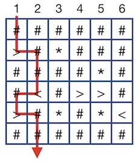
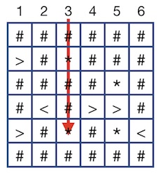
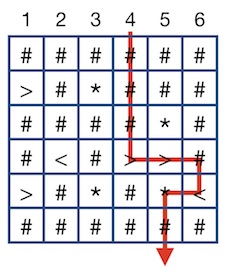

## 1. 메일 규격
주어진 메일 주소 중, 규격에 맞는 주소는 몇 개인지 구하려 합니다. 메일 규격은 다음과 같습니다.
- 규격에 맞는 메일은 이름@도메인이름.탑레벨도메인 형식입니다.
- 이름은 영문 소문자와 .로만 구성됩니다.
- 도메인이름은 영문 소문자로만 구성됩니다.
- 탑레벨도메인은 com, net, org 중 하나입니다.

### 1.1 제한사항
- emails의 길이는 1 이상 100,000 이하입니다.
- emails의 원소는 길이가 1 이상 100 이하인 문자열입니다.
- emails의 원소는 영문 소문자, ., @로 이루어진 문자열입니다.

### 1.2 입출력 예
|                         emails                        | result |
|:-----------------------------------------------------:|:------:|
| ["d@co@m.com", "a@abc.com", "b@def.com", "c@ghi.net"] |    3   |
|  ["abc.def@x.com", "abc", "abc@defx", "abc@defx.xyz"] |    1   |

#### 1.2.1 입출력 예 설명
**_입출력 예 #1_**  
d@co@m.com만 규격에 맞지 않고 나머지는 규격에 맞습니다.

**_입출력 예 #1_**  
abc.def@x.com만 규격에 맞습니다.

## 2. 구슬 떨어뜨리기
구슬을 장치에 떨어트렸을 때, 구슬이 바닥으로 떨어지는 시작 위치는 몇 개인지 세려고 합니다.
장치는 1 x 1 칸으로 이루어진 N x N 크기 정사각 격자 형태입니다. 각 칸에는 `#`, `>`, `<`, `*`이 적혀있습니다. 구슬은 `#`을 만나면 아래로 한 칸, `>`을 만나면 오른쪽으로 한 칸, `<`를 만나면 왼쪽으로 한 칸 이동합니다. 또, 구슬은 `*`을 처음 만나면 아래로 한 칸 이동하며, 두 번째로 `*`를 만나면 그 자리에서 멈춥니다.
다음은 장치가 6 x 6 크기인 경우의 예시입니다.  
  
예를 들어 1번 위치에서 구슬을 떨어 뜨릴 경우 구슬이 붉은 선을 따라 이동한 후 바닥으로 떨어집니다.  
  
그러나 위 그림과 같이 3번 위치에서 구슬을 떨어뜨리면 두 번째로 만난 * 칸에서 멈춥니다.
각 칸에 적힌 기호를 문자열 형태로 담은 배열 drum이 매개변수로 주어질 때, 구슬이 장치를 완전히 빠져나가 바닥으로 떨어지는 시작 위치는 총 몇 개인지 return 하도록 solution 함수를 완성해주세요.

### 2.1 매개변수 설명
매개변수 설명
- drum 배열의 길이는 5 이상 1,000 이하입니다.
- drum 배열의 원소는 장치의 각 행에 적힌 기호를 나타내는 문자열입니다.
	- 각 문자열의 길이는 drum 배열의 길이와 같습니다.
	- 문자열은 `#`, `>`, `<`, `*`로만 이루어져 있습니다.
- 장치 좌, 우측 경계를 벗어나는 경우는 입력으로 주어지지 않습니다.
- `>`와 `<`가 서로 마주 보아서, 구슬이 떨어지지 않고 무한히 움직이는 경우는 입력으로 주어지지 않습니다.

### 2.2 입출력 예
- 첫 번째 행에 공백(space)을 구분자로 숫자가 주어진다
	- 각 숫자는 한 자리 숫자로 주어진다 (0과 같거나 크고, 10보다 작은 숫자)
	- 같은 숫자가 중복되어 나타나지 않는다
- 두 번째 행에 찾으려는 수열의 순서(k)가 주어진다
	- k는 조합된 순열의 개수보다 크거나 작지 않다

#### 2.2.1 입출력 예 설명
**_입출력 예 #1_**  
구슬을 4번 위치에서 떨어뜨린 예시는 다음과 같습니다.  
  
구슬이 바닥에 떨어지는 위치는 1번, 2번, 4번, 6번 위치로 총 4개입니다.

## 3. 프린터 인쇄
제임스가 일하는 사무실에는 문서를 한 번에 하나씩 인쇄할 수 있는 프린터 한 대가 있습니다. 혼자 프린터를 사용할 때는 별 문제가 없지만, 여러 사람이 동시에 프린터를 사용할 때는 어떤 문서를 먼저 인쇄할지 정해야 합니다. 일반적인 프린터의 경우 먼저 요청된 문서를 먼저 인쇄하지만, 제임스는 보다 효율적인 일처리를 위해 다음과 같이 프린터가 인쇄 요청을 처리하는 규칙을 정했습니다.
1. 인쇄 중 또는 대기 중인 문서가 없을 때 인쇄 요청된 문서는 즉시 인쇄합니다.
2. 인쇄 중 또는 대기 중인 문서가 있을 때 인쇄 요청된 문서는 대기열에 추가합니다.
3. 인쇄 중인 문서가 전부 인쇄된 후 대기열에서 다음 문서를 선택해 인쇄합니다.
	1. 대기 중인 문서중 페이지 수가 적은 문서부터 인쇄합니다.
	2. 대기 중인 문서중 페이지 수가 같은 문서가 있을 경우, 먼저 요청된 문서부터 인쇄합니다.
	3. 현재 인쇄 중인 문서의 인쇄가 끝난 시각과 새로 요청된 문서의 인쇄 요청 시각이 같은 경우, 새로 요청된 문서를 먼저 대기열에 추가한 후 다음에 인쇄해야 될 문서를 선택합니다.

제임스는 프린터가 규칙대로 작동하는지 테스트하기 위해 가상의 인쇄 요청 데이터를 만들어 입력해보려 합니다. 각 인쇄 요청 데이터는 다음과 같은 형식입니다.
- [문서 번호, 인쇄 요청 시각, 페이지 수]

단, 인쇄 요청 시각은 0초부터 시작하며, 초 단위로 나타냅니다. 예를 들어, 어떤 문서의 인쇄 요청 데이터가 [2, 2, 4]인 경우, 이는 2번 문서가 2초에 인쇄 요청됐으며, 4페이지를 인쇄해야 된다는 의미입니다. 또한 한 페이지를 인쇄하는 데에는 1초가 걸립니다.
인쇄 요청 데이터들이 들어있는 배열 data가 매개변수로 주어질 때, 배열에 인쇄가 완료되는 순서대로 문서 번호를 담아 return 하도록 solution 함수를 완성해주세요.

### 3.1 제한 사항
- data는 가로(열) 길이가 3, 세로(행) 길이가 1 이상 100,000 이하인 2차원 배열입니다.  
- data의 원소는 [문서 번호, 인쇄 요청 시각, 페이지 수] 형식입니다.
	- 인쇄할 문서가 N개일 때, 모든 문서에는 1부터 N까지 번호가 하나씩 붙어있습니다.
	- data의 각 행은 문서 번호와 인쇄 요청 시각이 증가하는 순서로 주어집니다.
	- 즉, data의 각 행의 문서 번호는 1부터 N까지 오름차순 형태로 주어지며, 번호가 클수록 나중에 인쇄 요청된 문서입니다.
	- 인쇄 요청 시각이 같은 문서는 없습니다.
	- 인쇄 요청 시각은 0 이상 100,000,000 이하인 자연수입니다.
	- 페이지 수는 1 이상 100,000 이하인 자연수입니다.
- 문서를 대기열에 추가하거나, 다음 인쇄할 문서를 선택하는데 걸리는 시간은 없다고 가정합니다.

### 3.2 입출력 예
|                            data                            |    result   |
|:----------------------------------------------------------:|:-----------:|
|    [[1, 0, 5],[2, 2, 2],[3, 3, 1],[4, 4, 1],[5, 10, 2]]    | [1,3,4,2,5] |
|  [[1, 0, 3], [2, 1, 3], [3, 3, 2], [4, 9, 1], [5, 10, 2]]  | [1,3,2,4,5] |
| [[1, 2, 10], [2, 5, 8], [3, 6, 9], [4, 20, 6], [5, 25, 5]] | [1,2,4,5,3] |

#### 3.2.1 입출력 설명
**_입출력 예 #1_**

문서 데이터

| 문서 번호 | 인쇄 요청 시각 | 페이지 수 |
|:---------:|:--------------:|:---------:|
|     1     |        0       |     5     |
|     2     |        2       |     2     |
|     3     |        3       |     1     |
|     4     |        4       |     1     |
|     5     |       10       |     2     |

작동 상태

| 시각 | 인쇄중 문서 번호 | 대기중 문서 번호 |
|:----:|:----------------:|:----------------:|
|   0  |         1        |        []        |
|   1  |         1        |        []        |
|   2  |         1        |        [2]       |
|   3  |         1        |      [2, 3]      |
|   4  |         1        |      [2, 3]      |
|   5  |         3        |      [2, 4]      |
|   6  |         4        |        [2]       |
|   7  |         2        |        []        |
|   8  |         2        |        []        |
|   9  |       없음       |        []        |
|  10  |         5        |        []        |
|  11  |         5        |        []        |

1번 문서는 총 5페이지이므로 인쇄에 5초가 걸립니다. 0초에 인쇄를 시작했으므로, 5초가 되는 순간 인쇄가 끝나 다음으로 인쇄할 문서를 고릅니다. 대기열에는 2초, 3초, 4초 때 추가된 [2번, 3번, 4번] 문서가 있습니다. 이 중 다음으로 인쇄할 문서는 가장 페이지수가 적으면서 가장 먼저 요청된 3번 문서입니다. 마찬가지로 나머지 문서도 인쇄하면 [1번, 3번, 4번, 2번, 5번] 문서 순으로 인쇄합니다.

**_입출력 예 #2_**

문서 데이터

| 문서 번호 | 인쇄 요청 시각 | 페이지 수 |
|:---------:|:--------------:|:---------:|
|     1     |        0       |     3     |
|     2     |        1       |     3     |
|     3     |        3       |     2     |
|     4     |        9       |     1     |
|     5     |       10       |     2     |

작동 상태

| 시각 | 인쇄중 문서 번호 | 대기중 문서 번호 |
|:----:|:----------------:|:----------------:|
|   0  |         1        |        []        |
|   1  |         1        |        [2]       |
|   2  |         1        |        [2]       |
|   3  |         3        |        [2]       |
|   4  |         3        |        [2]       |
|   5  |         2        |        []        |
|   6  |         2        |        []        |
|   7  |         2        |        []        |
|   8  |       없음       |        []        |
|   9  |         4        |        []        |
|  10  |         5        |        []        |
|  11  |         5        |        []        |
